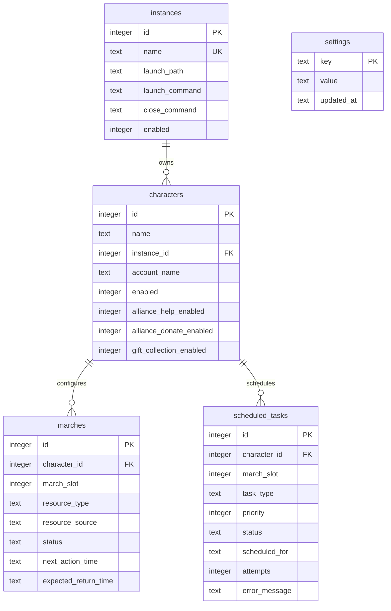
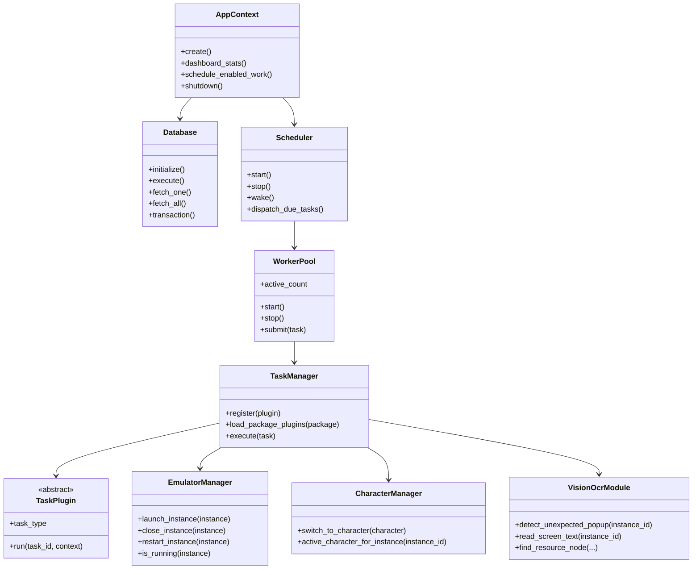

# Architecture

## Objective

This project is a production-ready scaffold for a Windows desktop assistant that manages emulator instances, characters, march configuration, scheduled jobs, retries, logging, and JSON configuration.

Game-specific interaction is isolated behind task plugins, the emulator manager, and the vision/OCR interface.

## Folder Structure

```text
rok_resource_assistant/
  main.py
  config/app_config.json
  src/rok_assistant/
    app.py
    config.py
    logging_setup.py
    recovery.py
    db/
      database.py
      schema.py
      models.py
      repositories.py
    emulator/
      manager.py
    characters/
      manager.py
    scheduler/
      scheduler.py
      worker_pool.py
    tasks/
      base.py
      manager.py
      gathering.py
      alliance.py
    vision/
      ocr.py
    gui/
      main_window.py
      dashboard.py
      instance_manager.py
      character_manager.py
      march_config.py
      task_queue.py
      settings.py
      log_viewer.py
    plugins/
  tests/
```

## Database Schema



## Class Diagram



## Scheduler Design

The scheduler is event-driven and poll-assisted:

- A background scheduler thread wakes at a configurable interval.
- It queries due tasks where `scheduled_for <= now`.
- Tasks are marked `queued` before submission.
- Work is submitted into a priority queue.
- Worker threads execute tasks independently.
- The scheduler can be woken immediately when the GUI creates new tasks.

Defaults:

- Max workers: 5
- Retry delay: 10 minutes
- Poll interval: 5 seconds

## Worker Design

The worker pool owns a priority queue and a fixed number of daemon worker threads.

Each worker:

1. Receives a queued task.
2. Marks it running through `TaskManager`.
3. Executes the registered task plugin.
4. Records completed, failed, or retrying state.
5. Logs status and duration.

## Emulator Manager Design

Each instance stores:

- Name
- Launch path
- Launch command
- Close command
- Enabled flag

The manager can:

- Launch configured commands.
- Close configured commands or terminate tracked processes.
- Track runtime state.
- Restart failed instances.

Process detection is local to the running application session. For production use, add emulator-specific detection by window title, process name, or vendor CLI.

## Character Manager Design

Characters are assigned to instances and may share an account name. The manager caches the active character per instance to minimize unnecessary switching. Real account switching should be implemented in a task or GUI automation plugin.

## GUI Wireframes

### Dashboard

```text
+---------------------------------------------------------------+
| Active Workers | Running Instances | Characters | Pending ... |
+---------------------------------------------------------------+
| Task Overview                                                  |
| Instance | Character | Task | Status | Next Action             |
+---------------------------------------------------------------+
```

### Instance Manager

```text
+---------------------------------------------------------------+
| Name [LD01]                                                    |
| Path [C:\LDPlayer]                                             |
| Launch Command [dnplayer.exe index=0]                          |
| Close Command  [dnconsole.exe quit --index 0]                  |
| [x] Enabled                                                    |
| [Save] [Clear] [Delete] [Launch] [Close]                       |
| ID | Name | Path | Launch Command | Close Command | Enabled    |
+---------------------------------------------------------------+
```

### Character Manager

```text
+---------------------------------------------------------------+
| Character Name | Account Name | Assigned Instance              |
| [x] Enabled [x] Alliance Help [x] Donate [x] Gifts             |
| [Save] [Clear] [Delete]                                       |
| ID | Instance | Account | Character | Enabled | Help | Donate  |
+---------------------------------------------------------------+
```

### March Configuration

```text
+---------------------------------------------------------------+
| Character dropdown                       [Save] [Create Tasks] |
| Slot | Resource Source | Resource Type | Status | Next Action  |
| 1    | Alliance Pit    | Gold          | idle   |              |
| 2    | Alliance Pit    | Gold          | idle   |              |
| 3    | Wild Node       | Stone         | idle   |              |
| 4    | Wild Node       | Wood          | idle   |              |
| 5    | Wild Node       | Food          | idle   |              |
+---------------------------------------------------------------+
```

## Error Handling Strategy

Detected conditions:

- Emulator launch failure
- Character switch failure
- Unexpected popup
- OCR failure
- Task timeout or plugin exception

Actions:

- Write structured log entry.
- Mark task failed or retrying.
- Retry after configured delay.
- Stop retrying after max attempts.
- Allow emulator restart through `EmulatorManager.restart_instance`.

## Plugin Expansion

Add a Python module under `src/rok_assistant/plugins` or another package listed in `config/app_config.json`.

```python
from rok_assistant.tasks.base import TaskContext, TaskPlugin, TaskResult


class MyTask(TaskPlugin):
    task_type = "my_task"
    display_name = "My Task"

    def run(self, task_id: int, context: TaskContext) -> TaskResult:
        return TaskResult(True, "Done")
```

## Implementation Roadmap

1. Add emulator-specific process detection and CLI adapters for LDPlayer, BlueStacks, or Nox.
2. Replace `VisionOcrModule` stubs with OCR and screenshot capture.
3. Add per-task timeout controls and cancellation.
4. Add richer task templates for gathering, donations, gifts, and recovery.
5. Add encrypted storage for sensitive account metadata if needed.
6. Add integration tests with mocked emulator and OCR modules.
7. Add packaging with PyInstaller for Windows distribution.
